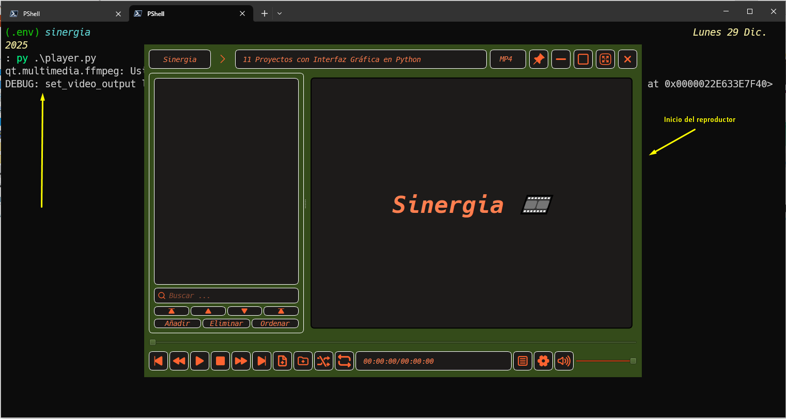
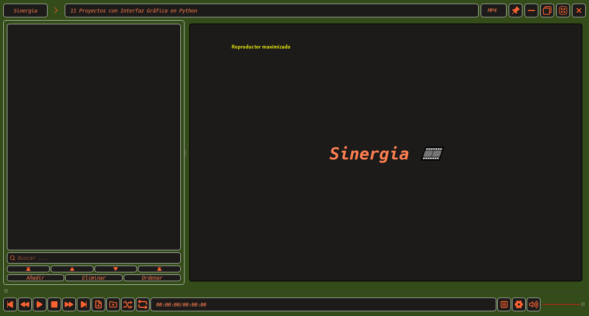

# Reproductor Sinergia
### Hecho con PySide 6 librería grafica de Python 3.

#### ↓ Colaboradores 

<h3><a target="_blank" href="https://gitlab.com/keincode" title="Hector Martinez">@keincode</a></h3>
<h3><a target="_blank" href="https://github.com/a-tomy-c" title="tomy">@a-tomy-c</a></h3>
------------------------------------------------------------------------------------

------------------------------------------------------------------------------------

------------------------------------------------------------------------------------
<!--  -->
[Reproductor Sinergia/Doraemon](https://youtu.be/P1juQCHdCqg)