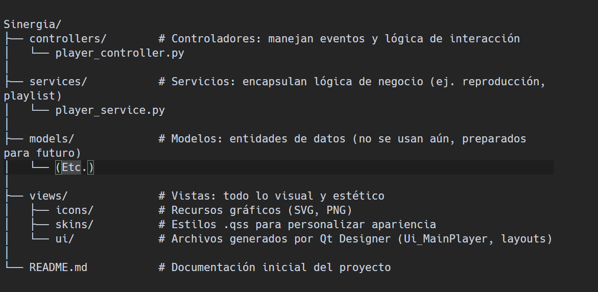

# Reproductor Sinergia Doraemon
### Hecho con PySide 6 librería grafica de Python 3.

#### ↓ Colaboradores 

<h3>
<a target="_blank" href="https://github.com/a-tomy-c" title="Tomy">@a-tomy-c</a>
</h3>
<h3>
<a target="_blank" href="https://github.com/crostow" title="Mau">@crostow</a>
</h3>

------------------------------------------------------------------------------------

<!--  -->
------------------------------------------------------------------------------------

------------------------------------------------------------------------------------

------------------------------------------------------------------------------------
[](https://youtu.be/P1juQCHdCqg)

<!-- <a href="https://youtu.be/P1juQCHdCqg" target="_blank">

</a> -->


## NOTAS
### widget Playlist
- la interfaz y metodos de la playlist estan ahora en un paquete
- agregue los metodos que faltaban de (seleccion primero y ultimo) el de agregar lo hare luego (necesitare el dialog)
- en el archivo `test_widgets` esta la prueba con el **playlist**
- [ ] agregar archivos

### widget Player
- agregue el widget player (solo tiene funciones basicas)


### Interfaz
- corte la playlist y lo coloque en un widget independiente
- cambie un label por un textedit (lbMeta)


## ESTRUCTURA
la estructura actual y los archivos que ya estoy usando (ire agregando y reusando otras)

```
- views
- - ui_main_player.py
- - ui_main_player.ui
- - ui_playlist_widget.ui

- services
├── playlist_widget
|   ├── __init__.py
│   ├── ui_playlist_widget.py
│   └── ui_playlist_widget.ui
└── widget_player
    └── __init__.py
```

